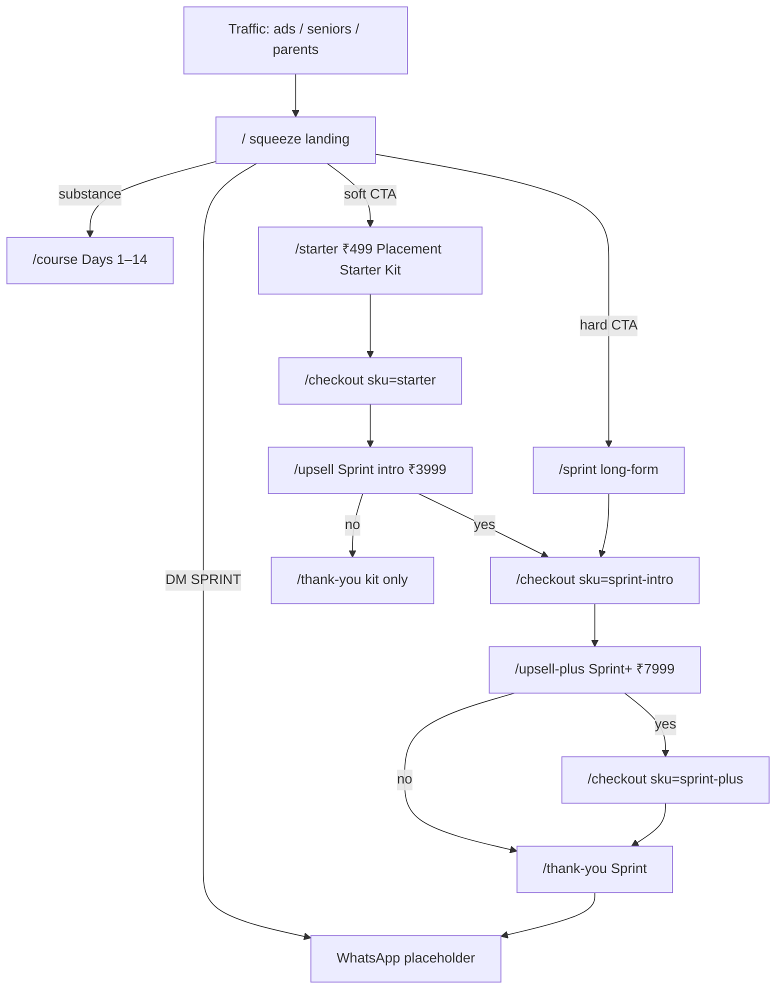

# Placement Sprint

Marketing site + DotCom Secrets value ladder for **Placement Sprint** — a 14-day, WhatsApp/Zoom offer for Indian undergrads (CSE / BCA / BBA, semester 6–8).

Headline: *Your placement season starts in 14 days — not “someday.”*

This is a demo funnel. Checkout buttons are Razorpay / Stripe **placeholders** (no live charges). WhatsApp uses a `wa.me` placeholder. Full voice pack: [`FUNNEL-COPY.md`](./FUNNEL-COPY.md).

## Run locally

```bash
npm install
npm run dev
```

App: [http://127.0.0.1:43123](http://127.0.0.1:43123)

```bash
npm run build
npm start -- --port 43123
```

## Funnel (value ladder)



| Step | Route | Price |
| --- | --- | --- |
| Squeeze | `/` | Free |
| Course outlines | `/course` | Full Days 1–14 (from `COURSE-14-DAY.md`) |
| Tripwire | `/starter` | ₹499 (+ ₹199 bump) |
| Mock pay | `/checkout?sku=` | — |
| OTO 1 | `/upsell` | Sprint intro ₹3,999 (then ₹4,999) |
| Cold sales | `/sprint` | Same Sprint |
| OTO 2 | `/upsell-plus` | Sprint+ ₹7,999 |
| Onboarding | `/thank-you` | WhatsApp |
| Map | `/funnel` | This diagram, clickable |

**Core SKU (Sprint):** ATS resume + LinkedIn makeover + 2 mocks + day-by-day apps checklist. Start ≤48h, done in 14 days. ₹4999; first 20 seats ₹3999.

**₹499 Starter Kit:** resume scorecard + LinkedIn 15-min fix + first-10 applications map.

**Sprint+ ₹7999:** deeper mocks (HR+tech/behaviour) · application review · priority doubt window · faster feedback.

**Social proof:** labeled **DEMO** aliases only (A. Sharma, R. Patel, P. Iyer) — not real names, logos, or CTC screenshots.

## Stack

Next.js App Router, Tailwind v4, shadcn/ui. No database. Lead form writes `sessionStorage` only.

To go live later: swap `wa.me/919876543210`, connect Razorpay/Stripe keys on `/checkout`, replace the demo seat numbers.

## Static export (GitHub / githack)

`npm run build` writes HTML+assets to `out/` (`output: "export"`). The `live-demo` branch on GitHub is that tree at repo root for anonymous githack preview.
